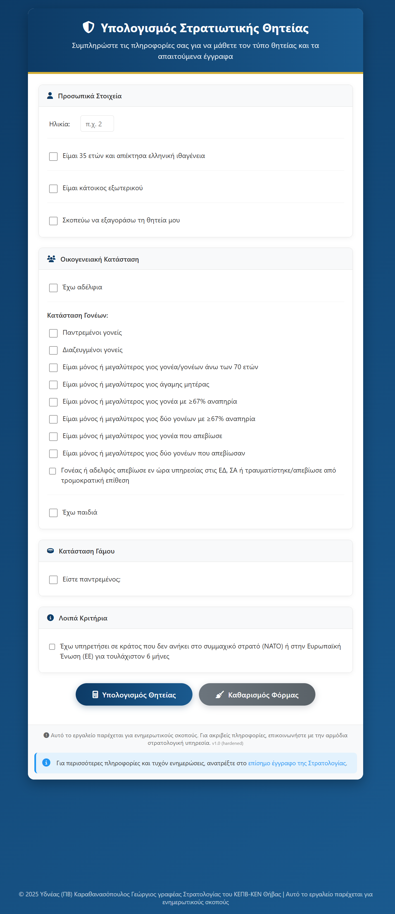

# Katataxi (Κατάταξη) 🇬🇷

[]()
[]()
[](LICENSE)

**Katataxi** is a client-side web tool designed to automate the classification process for new recruits in the Hellenic Army. It calculates military service duration, estimates buyout costs, and generates dynamic lists of required documentation based on current Greek legislation.



## 🎯 Project Goal & Impact
During my service at the Artillery Training Center (Thebes), I identified a bottleneck in the recruit classification process. New conscripts had difficulty determining their service duration, leading to delays and repetitive manual data entry.

**This tool was developed to:**
*   **Reduce Administrative Load:** Automates complex logic regarding family status and foreign residency.
*   **Improve Accuracy:** Minimizes human error in calculating reduced service terms.
*   **Streamline UX:** Provides recruits with an instant, clear list of required documents.

> 🏛️ **Operational Success & Adoption:**
>
> The tool was initially deployed to facilitate the reception of the **September and November 2025 recruits**, successfully processing thousands of cases.
>
> As of **December 2025**, this project has been **officially handed off to the Hellenic Army** for continued development and integration into internal unit systems. This repository serves as the v1.0 source code delivered during my tenure.

## ✨ Key Features
*   **Service Duration Logic:** Automatically calculates Full (12mo), Reduced (9mo, 6mo, 3mo), or Exempt status.
*   **Complex Criteria Handling:** Supports logic for:
    *   Polyteknoi / Triteknoi (Large families)
    *   Orphans & Single-parent families
    *   Foreign Residents (MKE) & Foreign Army Service
    *   Disability criteria
*   **Buyout Calculator (Εξαγορά):** Estimates financial cost for service buyout based on age limits and days served.
*   **Dynamic Document Generation:** Outputs a tailored checklist of required PDFs/certificates based on the specific user inputs.
*   **Privacy First:** Zero data collection. All calculations run locally in the browser (Client-Side).

## 🛠️ Tech Stack
*   **Core:** HTML5, CSS3, Vanilla JavaScript (ES6+).
*   **Styling:** CSS Variables for theming, Flexbox for layout.
*   **Assets:** FontAwesome (via CDN) for UI icons.
*   **Architecture:** Single-File Component (SFC) approach for easy portability and offline usage on military intranet systems.

## 🚀 Usage
This project is built to be zero-dependency and portable.

1.  Clone the repository:
    ```bash
    git clone https://github.com/B9KGF/katataxi.git
    ```
2.  Open `index.html` in any modern web browser (Chrome, Edge, Firefox).

## ⚠️ Disclaimer & Status
**Please Note:** This repository hosts the **v1.0 source code** as developed and delivered during my service (2025).

*   **Official Status:** This software has been handed off to the Hellenic Army (Artillery Training Center) for internal maintenance and integration.
*   **Updates:** This public repository is **frozen** and will not receive updates regarding future changes in conscription legislation.
*   **Liability:** This tool is for demonstration and portfolio purposes only. For official conscription calculations, always consult [stratologia.gr](https://www.stratologia.gr) or your local Conscription Service.
*   **License & Usage:** This source code is released under the **GNU GPLv3** license to ensure transparency and credit. However, as the operational version is maintained by the Hellenic Army, this repository is intended primarily as a technical portfolio reference.

---
_Developed by George Karathanasopoulos | 2025_
